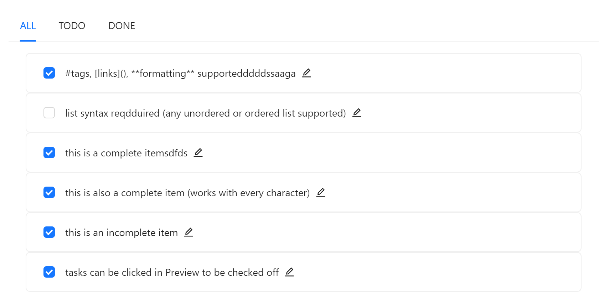
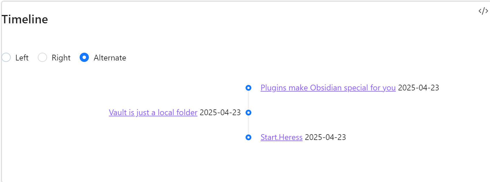

**Project Objective**  
The goal of QueryDash is to develop an Obsidian plugin similar to Notion Database, but not limited to database functionality.
**Since the API of Dataview is used, the Dataview plugin must be enabled.**
In the future, it will gradually expand with more practical features to help users manage knowledge, tasks, and life more efficiently.

**If you are interested in this project, please consider starring it. Thank you very much, it means a lot to me.**

**language**
- [English](README.md)
- [简体中文](README-zh.md)

**Current Features**
1. **Multi-view Support**: Provides table and list views to meet different scenario needs.
	- **timeline**: use timeline view to display data.
2. **Dataview SQL Support**: Compatible with Dataview's SQL syntax .
3. **Enhanced Features**:
	- **Search**: Quickly locate the content you need.
	- **Filter**: Screen data based on conditions.
	- **Aggregation**: Supports data summary statistics.
	- **Pagination**: Optimizes browsing experience for large datasets.
    - **Task**: Supports task management, including task editing.

**Tutorial**

**table**
~~~markdown
```querydash
table file.name , file.outlinks as "links" ,file.ctime as "ctime",
file.mtime as "mtime" ,file.tags as "tags" from #clippings
```
~~~


**task**


**timeline**

**simple mode**
~~~markdown
```querydash
timeline  from #start
```
~~~

**full mode**

If you want to append the time later, alias a specific field as "time".
~~~markdown
```querydash
timeline file.ctime as "time" from #start where file.ctime<=date(today) sort file.mtime desc
```
~~~

**Future Vision**
1. **Homepage**: Integrate frequently used functions into the homepage for one-stop convenience.
2. **Multi-view Support**: Supports timeline, gallery, table, and other views to meet diverse scenario needs.
3. **Review Cards**: Built-in review function to help users efficiently consolidate knowledge.
4. **Database Functionality**: Supports create, edit, delete, and other operations for flexible data management.
5. **More Features**: Continuous development to enrich plugin functionality and enhance user experience.

**Reference Projects**
- [Dataview](https://github.com/blacksmithgu/obsidian-dataview): A powerful data query and management tool.
- [Project](https://github.com/marcusolsson/obsidian-projects): A task and project management plugin.

**Project Introduction**  
As a deep user of Obsidian, I found that existing plugins could not fully meet my needs in terms of search, review, and editing/deleting Dataview tables. Therefore, I decided to develop a brand-new view system based on Ant Design, aiming to enhance the Obsidian experience and better assist daily life and work.

Currently, the project is in its early stages, but I will continue to invest in development to gradually improve and expand its features. I believe that through continuous iteration, this project will become increasingly practical and powerful.

**About Sponsorship**  
This project is entirely developed out of personal interest. If you find it helpful and are willing to support my work, every sponsorship will be a motivation for me to continue developing. Thank you very much!

**Future Plans**
- Improve existing features to enhance user experience.
- Add more practical features, such as advanced search and intelligent review.
- Optimize performance to ensure system stability.
